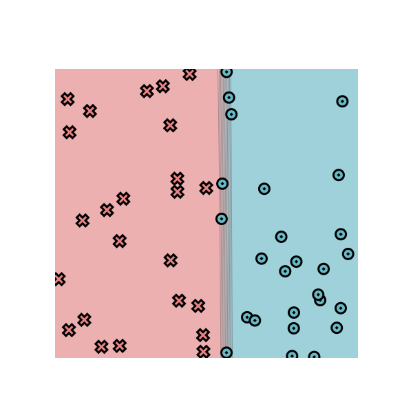
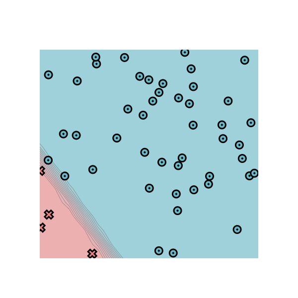
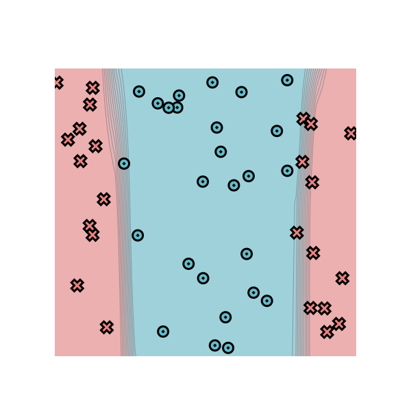
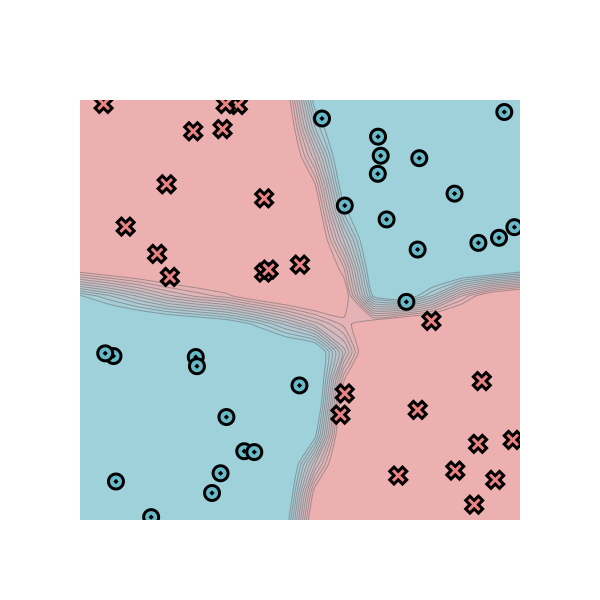

[](https://classroom.github.com/a/YFgwt0yY)
# MiniTorch Module 2


* Docs: https://minitorch.github.io/

* Overview: https://minitorch.github.io/module2/module2/

This assignment requires the following files from the previous assignments. You can get these by running

```bash
python sync_previous_module.py previous-module-dir current-module-dir
```

The files that will be synced are:

        minitorch/operators.py minitorch/module.py minitorch/autodiff.py minitorch/scalar.py minitorch/scalar_functions.py minitorch/module.py project/run_manual.py project/run_scalar.py project/datasets.py


## Training

### Simple Dataset
```python
# Configurations
PTS = 50
HIDDEN = 2
RATE = 0.5
data = minitorch.datasets["Simple"](PTS)
```
Training log:
```
Epoch: 0/500, loss: 0, correct: 0
Epoch: 10/500, loss: 34.61792319843694, correct: 26
Epoch: 20/500, loss: 34.4902578969579, correct: 28
Epoch: 30/500, loss: 34.22645555502727, correct: 50
Epoch: 40/500, loss: 33.43951504915415, correct: 43
Epoch: 50/500, loss: 30.253372324459125, correct: 45
Epoch: 60/500, loss: 22.854466870044327, correct: 45
Epoch: 70/500, loss: 16.994105668198465, correct: 45
Epoch: 80/500, loss: 12.876562799034465, correct: 50
Epoch: 90/500, loss: 20.51666477865316, correct: 40
Epoch: 100/500, loss: 9.521234310863543, correct: 49
Epoch: 110/500, loss: 12.197812320646088, correct: 44
Epoch: 120/500, loss: 10.716550606608168, correct: 44
Epoch: 130/500, loss: 9.308374538608618, correct: 44
Epoch: 140/500, loss: 9.331939768241334, correct: 44
Epoch: 150/500, loss: 7.71546905278575, correct: 47
Epoch: 160/500, loss: 7.08780716500261, correct: 47
Epoch: 170/500, loss: 7.995318366395152, correct: 46
Epoch: 180/500, loss: 5.915046596608359, correct: 47
Epoch: 190/500, loss: 4.289737650422675, correct: 49
Epoch: 200/500, loss: 4.444948191157884, correct: 48
Epoch: 210/500, loss: 8.701379799937582, correct: 45
Epoch: 220/500, loss: 3.3447284122244128, correct: 49
Epoch: 230/500, loss: 2.681239326439458, correct: 50
Epoch: 240/500, loss: 2.522690235021044, correct: 50
Epoch: 250/500, loss: 2.515116181785065, correct: 50
Epoch: 260/500, loss: 2.6452704809746286, correct: 50
Epoch: 270/500, loss: 6.152874091656158, correct: 47
Epoch: 280/500, loss: 3.7928813622078703, correct: 48
Epoch: 290/500, loss: 1.9792159990562967, correct: 50
Epoch: 300/500, loss: 1.8012588128963092, correct: 50
Epoch: 310/500, loss: 1.6805717428134959, correct: 50
Epoch: 320/500, loss: 1.5738017725944071, correct: 50
Epoch: 330/500, loss: 1.480997504081884, correct: 50
Epoch: 340/500, loss: 1.3969547371064277, correct: 50
Epoch: 350/500, loss: 1.3174392186558617, correct: 50
Epoch: 360/500, loss: 1.248056255159079, correct: 50
Epoch: 370/500, loss: 1.184735251025859, correct: 50
Epoch: 380/500, loss: 1.1266358647789498, correct: 50
Epoch: 390/500, loss: 1.0731714643324262, correct: 50
Epoch: 400/500, loss: 1.0238472676175658, correct: 50
Epoch: 410/500, loss: 0.9782358846738275, correct: 50
Epoch: 420/500, loss: 0.9359648789116091, correct: 50
Epoch: 430/500, loss: 0.8967253533766535, correct: 50
Epoch: 440/500, loss: 0.861847994346644, correct: 50
Epoch: 450/500, loss: 0.8281034725422712, correct: 50
Epoch: 460/500, loss: 0.7966101720979842, correct: 50
Epoch: 470/500, loss: 0.7671452971348768, correct: 50
Epoch: 480/500, loss: 0.7385083965240246, correct: 50
Epoch: 490/500, loss: 0.7126669043857339, correct: 50
Epoch: 500/500, loss: 0.6884997984737384, correct: 50
```
Time per epoch: 0.026s.

Final Image


### Diagonal Dataset
```python
# Configurations
PTS = 50
HIDDEN = 2
RATE = 0.5
data = minitorch.datasets["Diag"](PTS)
```
Training log:
```
Epoch: 0/500, loss: 0, correct: 0
Epoch: 10/500, loss: 15.26618762856435, correct: 46
Epoch: 20/500, loss: 13.876245973270471, correct: 46
Epoch: 30/500, loss: 13.718939301089614, correct: 46
Epoch: 40/500, loss: 13.617133877973863, correct: 46
Epoch: 50/500, loss: 13.477475655852102, correct: 46
Epoch: 60/500, loss: 13.270461375070747, correct: 46
Epoch: 70/500, loss: 12.958073743690052, correct: 46
Epoch: 80/500, loss: 12.471388036363445, correct: 46
Epoch: 90/500, loss: 11.693952733749652, correct: 46
Epoch: 100/500, loss: 10.544954814558789, correct: 46
Epoch: 110/500, loss: 9.601240537270765, correct: 46
Epoch: 120/500, loss: 8.799767821547094, correct: 46
Epoch: 130/500, loss: 8.07942156478389, correct: 46
Epoch: 140/500, loss: 7.369473640826439, correct: 46
Epoch: 150/500, loss: 6.689180094563782, correct: 46
Epoch: 160/500, loss: 6.081262727478226, correct: 46
Epoch: 170/500, loss: 5.494817721148263, correct: 46
Epoch: 180/500, loss: 5.037666567006894, correct: 46
Epoch: 190/500, loss: 4.676986730878212, correct: 46
Epoch: 200/500, loss: 4.304234650737355, correct: 46
Epoch: 210/500, loss: 3.987968238902374, correct: 46
Epoch: 220/500, loss: 3.7447324272192812, correct: 49
Epoch: 230/500, loss: 3.4656286781067207, correct: 49
Epoch: 240/500, loss: 3.278198338187291, correct: 50
Epoch: 250/500, loss: 3.0546334131762873, correct: 49
Epoch: 260/500, loss: 2.8762903793712282, correct: 50
Epoch: 270/500, loss: 2.7157041267871542, correct: 50
Epoch: 280/500, loss: 2.570655807396749, correct: 50
Epoch: 290/500, loss: 2.435742682322445, correct: 50
Epoch: 300/500, loss: 2.3153309162838305, correct: 50
Epoch: 310/500, loss: 2.2302761969920355, correct: 50
Epoch: 320/500, loss: 2.1065332551075904, correct: 50
Epoch: 330/500, loss: 2.0140502215147875, correct: 50
Epoch: 340/500, loss: 1.9514375637355381, correct: 50
Epoch: 350/500, loss: 1.8517484525309018, correct: 50
Epoch: 360/500, loss: 1.7786719775756707, correct: 50
Epoch: 370/500, loss: 1.7109951690201706, correct: 50
Epoch: 380/500, loss: 1.6478391310080707, correct: 50
Epoch: 390/500, loss: 1.58867275114033, correct: 50
Epoch: 400/500, loss: 1.5334285737625277, correct: 50
Epoch: 410/500, loss: 1.48004219773014, correct: 50
Epoch: 420/500, loss: 1.430629375124133, correct: 50
Epoch: 430/500, loss: 1.3838680666029246, correct: 50
Epoch: 440/500, loss: 1.3546120835144895, correct: 50
Epoch: 450/500, loss: 1.2970041744704401, correct: 50
Epoch: 460/500, loss: 1.2569803961289177, correct: 50
Epoch: 470/500, loss: 1.218614951341795, correct: 50
Epoch: 480/500, loss: 1.1824221989029624, correct: 50
Epoch: 490/500, loss: 1.14756312754724, correct: 50
Epoch: 500/500, loss: 1.12704035412751, correct: 50
```
Time per epoch: 0.026s.

Final Image



### Split Dataset
```python
PTS = 50
HIDDEN = 12
RATE = 0.5
data = minitorch.datasets["Split"](PTS)
```
Training loss
```
Epoch: 0/500, loss: 0, correct: 0
Epoch: 10/500, loss: 32.04482936646974, correct: 36
Epoch: 20/500, loss: 29.90983634431506, correct: 41
Epoch: 30/500, loss: 27.366115981796387, correct: 41
Epoch: 40/500, loss: 27.185781953955075, correct: 32
Epoch: 50/500, loss: 23.236962540108994, correct: 39
Epoch: 60/500, loss: 21.572125772414168, correct: 41
Epoch: 70/500, loss: 22.068978858818383, correct: 38
Epoch: 80/500, loss: 18.67485413462952, correct: 42
Epoch: 90/500, loss: 13.853554856711455, correct: 44
Epoch: 100/500, loss: 17.533683980518855, correct: 43
Epoch: 110/500, loss: 11.74407414618694, correct: 45
Epoch: 120/500, loss: 13.30431040420355, correct: 45
Epoch: 130/500, loss: 9.441062825275125, correct: 46
Epoch: 140/500, loss: 11.9370115212334, correct: 45
Epoch: 150/500, loss: 7.7753318839775245, correct: 46
Epoch: 160/500, loss: 8.7903163943177, correct: 46
Epoch: 170/500, loss: 7.1304175461641774, correct: 46
Epoch: 180/500, loss: 6.186328227556933, correct: 46
Epoch: 190/500, loss: 7.1527115857354175, correct: 46
Epoch: 200/500, loss: 5.884499738042113, correct: 46
Epoch: 210/500, loss: 5.242504171869173, correct: 47
Epoch: 220/500, loss: 5.588891645357463, correct: 46
Epoch: 230/500, loss: 5.478079815152148, correct: 46
Epoch: 240/500, loss: 4.629486371216768, correct: 48
Epoch: 250/500, loss: 4.559670321797361, correct: 48
Epoch: 260/500, loss: 5.1628116744995225, correct: 46
Epoch: 270/500, loss: 4.633226246050435, correct: 48
Epoch: 280/500, loss: 3.393175168527315, correct: 49
Epoch: 290/500, loss: 4.092979586287547, correct: 48
Epoch: 300/500, loss: 5.791107821048346, correct: 46
Epoch: 310/500, loss: 3.167747948858248, correct: 49
Epoch: 320/500, loss: 3.951468388849836, correct: 48
Epoch: 330/500, loss: 4.109624487716307, correct: 48
Epoch: 340/500, loss: 2.831321906489108, correct: 49
Epoch: 350/500, loss: 3.064852822382095, correct: 49
Epoch: 360/500, loss: 2.6158705663705994, correct: 49
Epoch: 370/500, loss: 4.083945647852093, correct: 48
Epoch: 380/500, loss: 4.243824318601352, correct: 48
Epoch: 390/500, loss: 2.0224148808136255, correct: 50
Epoch: 400/500, loss: 3.2732015018194267, correct: 49
Epoch: 410/500, loss: 2.20119884250312, correct: 49
Epoch: 420/500, loss: 3.887215481060042, correct: 48
Epoch: 430/500, loss: 3.025060375547612, correct: 49
Epoch: 440/500, loss: 1.8950526482886672, correct: 50
Epoch: 450/500, loss: 3.168360783580424, correct: 49
Epoch: 460/500, loss: 1.6386049753663996, correct: 50
Epoch: 470/500, loss: 2.528888885169718, correct: 49
Epoch: 480/500, loss: 7.241754266979675, correct: 46
Epoch: 490/500, loss: 1.4377014948884117, correct: 50
Epoch: 500/500, loss: 1.1569716540686203, correct: 50
```
Time per epoch: 0.261s

Final Image



### XOR Dataset
```python
PTS = 50
HIDDEN = 12
RATE = 0.5
data = minitorch.datasets["Xor"](PTS)
```
Training log:
```
Epoch: 0/500, loss: 0, correct: 0
Epoch: 10/500, loss: 28.970420288799335, correct: 35
Epoch: 20/500, loss: 23.40889938899184, correct: 43
Epoch: 30/500, loss: 20.83091641288782, correct: 42
Epoch: 40/500, loss: 16.48266890250246, correct: 48
Epoch: 50/500, loss: 14.112526567094445, correct: 46
Epoch: 60/500, loss: 12.095541718795598, correct: 47
Epoch: 70/500, loss: 9.35009586811129, correct: 49
Epoch: 80/500, loss: 8.448840393157045, correct: 49
Epoch: 90/500, loss: 8.809688032930103, correct: 48
Epoch: 100/500, loss: 6.334284938953551, correct: 49
Epoch: 110/500, loss: 4.9610045394939375, correct: 49
Epoch: 120/500, loss: 4.297083388813157, correct: 49
Epoch: 130/500, loss: 3.7380929059072026, correct: 50
Epoch: 140/500, loss: 2.9825552699012046, correct: 50
Epoch: 150/500, loss: 2.6329146973382818, correct: 50
Epoch: 160/500, loss: 2.397390589085581, correct: 50
Epoch: 170/500, loss: 2.18155230872486, correct: 50
Epoch: 180/500, loss: 1.9949816720880158, correct: 50
Epoch: 190/500, loss: 1.841062428642528, correct: 50
Epoch: 200/500, loss: 1.6951560734249642, correct: 50
Epoch: 210/500, loss: 1.575329011737028, correct: 50
Epoch: 220/500, loss: 1.4703654521970715, correct: 50
Epoch: 230/500, loss: 1.378235281623692, correct: 50
Epoch: 240/500, loss: 1.2906557017519038, correct: 50
Epoch: 250/500, loss: 1.212855467751341, correct: 50
Epoch: 260/500, loss: 1.1446730520789474, correct: 50
Epoch: 270/500, loss: 1.0809512957010707, correct: 50
Epoch: 280/500, loss: 1.022063908163, correct: 50
Epoch: 290/500, loss: 0.9691120877891529, correct: 50
Epoch: 300/500, loss: 0.9205481626685771, correct: 50
Epoch: 310/500, loss: 0.8754059250546027, correct: 50
Epoch: 320/500, loss: 0.8341294127635734, correct: 50
Epoch: 330/500, loss: 0.7955227500975205, correct: 50
Epoch: 340/500, loss: 0.759999269119968, correct: 50
Epoch: 350/500, loss: 0.7259811649006443, correct: 50
Epoch: 360/500, loss: 0.6948642786699455, correct: 50
Epoch: 370/500, loss: 0.6669415282284953, correct: 50
Epoch: 380/500, loss: 0.6382610958586902, correct: 50
Epoch: 390/500, loss: 0.613852796332045, correct: 50
Epoch: 400/500, loss: 0.589314950352869, correct: 50
Epoch: 410/500, loss: 0.5673361010607865, correct: 50
Epoch: 420/500, loss: 0.5461829852464631, correct: 50
Epoch: 430/500, loss: 0.5266586227906385, correct: 50
Epoch: 440/500, loss: 0.5073902611406237, correct: 50
Epoch: 450/500, loss: 0.48999735333751737, correct: 50
Epoch: 460/500, loss: 0.47300827318686894, correct: 50
Epoch: 470/500, loss: 0.4575845318506439, correct: 50
Epoch: 480/500, loss: 0.44248003347091397, correct: 50
Epoch: 490/500, loss: 0.42811795987457146, correct: 50
Epoch: 500/500, loss: 0.41468189778840475, correct: 50
```
Time per epoch: 0.260s.

Final Image
